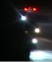
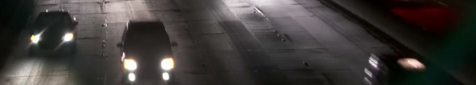

# Quét độc lập trước khi xem pre-label

Frame: ĐIỀN tên một ảnh trong `to_label/round1/images/train/`
frame_0099

Số xe nhìn thấy bằng mắt: 26 xe

Hai vị trí dễ bị AI bỏ sót hoặc vẽ sai, kèm mô tả xe: góc trên bên trái  có 3 xe vì có 3 đèn nhưng AI có thể nhầm là 2; trường hợp 2 là góc dưới bên phải  xe chỉ hiện 1 phần nhỏ, AI có thể không nhận diện được

Chạy `python3 tools/lock_blind.py` ngay sau khi điền. Sau đó giữ file này nguyên vẹn.
